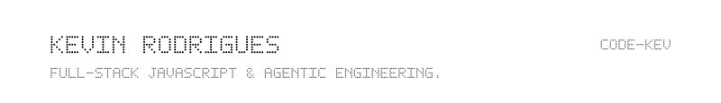
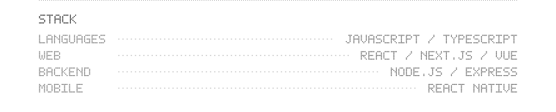
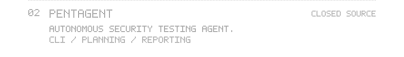
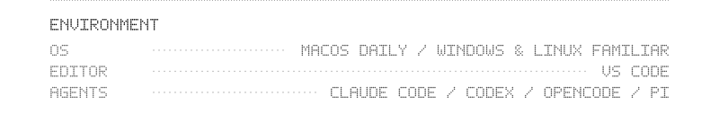
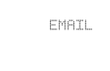
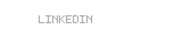
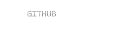

<picture>
<source media="(prefers-color-scheme: dark) and (prefers-reduced-motion: reduce)" srcset="assets/night.png">
<source media="(prefers-reduced-motion: reduce)" srcset="assets/day.png">
<source media="(prefers-color-scheme: dark)" srcset="assets/night.gif">

</picture>

<picture><source media="(max-width: 382px) and (prefers-color-scheme: dark)" srcset="assets/profile/identity-288-night.svg" width="288"><source media="(max-width: 382px)" srcset="assets/profile/identity-288-day.svg" width="288"><source media="(max-width: 600px) and (prefers-color-scheme: dark)" srcset="assets/profile/identity-350-night.svg" width="350"><source media="(max-width: 600px)" srcset="assets/profile/identity-350-day.svg" width="350"><source media="(prefers-color-scheme: dark)" srcset="assets/profile/identity-800-night.svg" width="800"></picture>
<picture><source media="(max-width: 382px) and (prefers-color-scheme: dark)" srcset="assets/profile/stack-288-night.svg" width="288"><source media="(max-width: 382px)" srcset="assets/profile/stack-288-day.svg" width="288"><source media="(max-width: 600px) and (prefers-color-scheme: dark)" srcset="assets/profile/stack-350-night.svg" width="350"><source media="(max-width: 600px)" srcset="assets/profile/stack-350-day.svg" width="350"><source media="(prefers-color-scheme: dark)" srcset="assets/profile/stack-800-night.svg" width="800"></picture>
<a href="https://github.com/code-kev/certkit"><picture><source media="(max-width: 382px) and (prefers-color-scheme: dark)" srcset="assets/profile/certkit-288-night.svg" width="288"><source media="(max-width: 382px)" srcset="assets/profile/certkit-288-day.svg" width="288"><source media="(max-width: 600px) and (prefers-color-scheme: dark)" srcset="assets/profile/certkit-350-night.svg" width="350"><source media="(max-width: 600px)" srcset="assets/profile/certkit-350-day.svg" width="350"><source media="(prefers-color-scheme: dark)" srcset="assets/profile/certkit-800-night.svg" width="800"></picture></a>
<picture><source media="(max-width: 382px) and (prefers-color-scheme: dark)" srcset="assets/profile/pentagent-288-night.svg" width="288"><source media="(max-width: 382px)" srcset="assets/profile/pentagent-288-day.svg" width="288"><source media="(max-width: 600px) and (prefers-color-scheme: dark)" srcset="assets/profile/pentagent-350-night.svg" width="350"><source media="(max-width: 600px)" srcset="assets/profile/pentagent-350-day.svg" width="350"><source media="(prefers-color-scheme: dark)" srcset="assets/profile/pentagent-800-night.svg" width="800"></picture>
<picture><source media="(max-width: 382px) and (prefers-color-scheme: dark)" srcset="assets/profile/environment-288-night.svg" width="288"><source media="(max-width: 382px)" srcset="assets/profile/environment-288-day.svg" width="288"><source media="(max-width: 600px) and (prefers-color-scheme: dark)" srcset="assets/profile/environment-350-night.svg" width="350"><source media="(max-width: 600px)" srcset="assets/profile/environment-350-day.svg" width="350"><source media="(prefers-color-scheme: dark)" srcset="assets/profile/environment-800-night.svg" width="800"></picture>
<picture><source media="(max-width: 382px) and (prefers-color-scheme: dark)" srcset="assets/profile/connect-288-night.svg" width="288"><source media="(max-width: 382px)" srcset="assets/profile/connect-288-day.svg" width="288"><source media="(max-width: 600px) and (prefers-color-scheme: dark)" srcset="assets/profile/connect-350-night.svg" width="350"><source media="(max-width: 600px)" srcset="assets/profile/connect-350-day.svg" width="350"><source media="(prefers-color-scheme: dark)" srcset="assets/profile/connect-800-night.svg" width="800"></picture>
 
<a href="mailto:rodrigs.kevin@gmail.com" aria-label="Email — rodrigs.kevin@gmail.com"><picture><source media="(max-width: 382px) and (prefers-color-scheme: dark)" srcset="assets/profile/contact-email-288-night.svg" width="80"><source media="(max-width: 382px)" srcset="assets/profile/contact-email-288-day.svg" width="80"><source media="(max-width: 600px) and (prefers-color-scheme: dark)" srcset="assets/profile/contact-email-350-night.svg" width="84"><source media="(max-width: 600px)" srcset="assets/profile/contact-email-350-day.svg" width="84"><source media="(prefers-color-scheme: dark)" srcset="assets/profile/contact-email-800-night.svg" width="124"></picture></a><a href="https://www.linkedin.com/in/kevin-rodrigues-js-dev/" aria-label="LinkedIn — https://www.linkedin.com/in/kevin-rodrigues-js-dev/"><picture><source media="(max-width: 382px) and (prefers-color-scheme: dark)" srcset="assets/profile/contact-linkedin-288-night.svg" width="87"><source media="(max-width: 382px)" srcset="assets/profile/contact-linkedin-288-day.svg" width="87"><source media="(max-width: 600px) and (prefers-color-scheme: dark)" srcset="assets/profile/contact-linkedin-350-night.svg" width="87"><source media="(max-width: 600px)" srcset="assets/profile/contact-linkedin-350-day.svg" width="87"><source media="(prefers-color-scheme: dark)" srcset="assets/profile/contact-linkedin-800-night.svg" width="98"></picture></a><a href="https://github.com/code-kev" aria-label="GitHub — https://github.com/code-kev"><picture><source media="(max-width: 382px) and (prefers-color-scheme: dark)" srcset="assets/profile/contact-github-288-night.svg" width="73"><source media="(max-width: 382px)" srcset="assets/profile/contact-github-288-day.svg" width="73"><source media="(max-width: 600px) and (prefers-color-scheme: dark)" srcset="assets/profile/contact-github-350-night.svg" width="77"><source media="(max-width: 600px)" srcset="assets/profile/contact-github-350-day.svg" width="77"><source media="(prefers-color-scheme: dark)" srcset="assets/profile/contact-github-800-night.svg" width="114"></picture></a>

