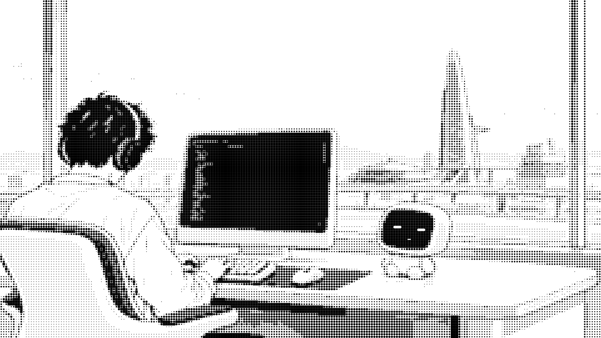
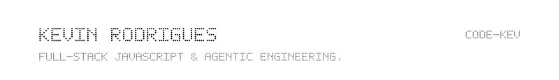
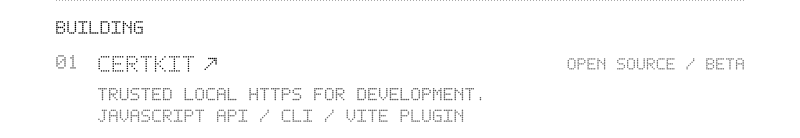
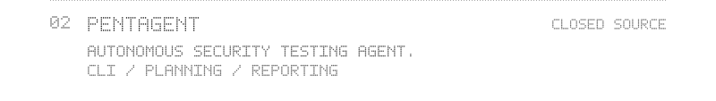
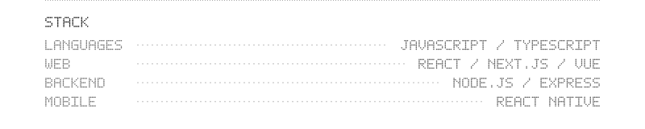
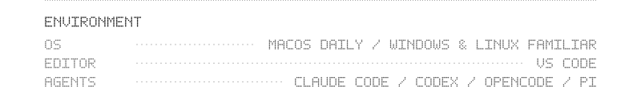

<picture>
<source media="(prefers-reduced-motion: reduce)" type="image/svg+xml" srcset="assets/still.svg">
<source media="(prefers-color-scheme: dark)" type="image/webp" srcset="assets/night.webp">
<source media="(prefers-color-scheme: light)" type="image/webp" srcset="assets/day.webp">
<source media="(prefers-color-scheme: dark)" srcset="assets/night.gif">

</picture>

<picture><source media="(max-width: 382px)" srcset="assets/profile/identity-288.svg"><source media="(max-width: 600px)" srcset="assets/profile/identity-350.svg"><source media="(max-width: 1200px)" srcset="assets/profile/identity-550.svg"></picture>
<a href="https://github.com/code-kev/certkit"><picture><source media="(max-width: 382px)" srcset="assets/profile/certkit-288.svg"><source media="(max-width: 600px)" srcset="assets/profile/certkit-350.svg"><source media="(max-width: 1200px)" srcset="assets/profile/certkit-550.svg"></picture></a>
<picture><source media="(max-width: 382px)" srcset="assets/profile/pentagent-288.svg"><source media="(max-width: 600px)" srcset="assets/profile/pentagent-350.svg"><source media="(max-width: 1200px)" srcset="assets/profile/pentagent-550.svg"></picture>
<picture><source media="(max-width: 382px)" srcset="assets/profile/stack-288.svg"><source media="(max-width: 600px)" srcset="assets/profile/stack-350.svg"><source media="(max-width: 1200px)" srcset="assets/profile/stack-550.svg"></picture>
<picture><source media="(max-width: 382px)" srcset="assets/profile/environment-288.svg"><source media="(max-width: 600px)" srcset="assets/profile/environment-350.svg"><source media="(max-width: 1200px)" srcset="assets/profile/environment-550.svg"></picture>
<picture><source media="(max-width: 382px)" srcset="assets/profile/connect-288.svg"><source media="(max-width: 600px)" srcset="assets/profile/connect-350.svg"><source media="(max-width: 1200px)" srcset="assets/profile/connect-550.svg"></picture>
 
<a href="mailto:rodrigs.kevin@gmail.com" aria-label="Email — rodrigs.kevin@gmail.com"><picture><source media="(max-width: 382px)" srcset="assets/profile/contact-email-288.svg"><source media="(max-width: 600px)" srcset="assets/profile/contact-email-350.svg"><source media="(max-width: 1200px)" srcset="assets/profile/contact-email-550.svg"></picture></a><a href="https://www.linkedin.com/in/kevin-rodrigues-js-dev/" aria-label="LinkedIn — https://www.linkedin.com/in/kevin-rodrigues-js-dev/"><picture><source media="(max-width: 382px)" srcset="assets/profile/contact-linkedin-288.svg"><source media="(max-width: 600px)" srcset="assets/profile/contact-linkedin-350.svg"><source media="(max-width: 1200px)" srcset="assets/profile/contact-linkedin-550.svg"></picture></a><a href="https://github.com/code-kev" aria-label="GitHub — https://github.com/code-kev"><picture><source media="(max-width: 382px)" srcset="assets/profile/contact-github-288.svg"><source media="(max-width: 600px)" srcset="assets/profile/contact-github-350.svg"><source media="(max-width: 1200px)" srcset="assets/profile/contact-github-550.svg"></picture></a>

[Text / static profile](docs/profile.md) · [Artwork & skill](docs/README.md)
