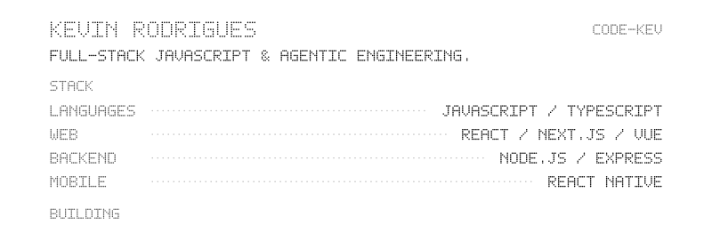
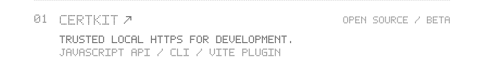
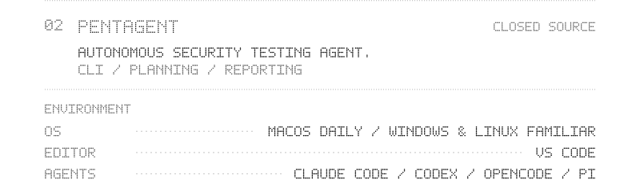
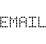
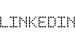
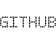

<picture>
  <source media="(prefers-color-scheme: dark) and (prefers-reduced-motion: reduce)" srcset="assets/night.png">
  <source media="(prefers-reduced-motion: reduce)" srcset="assets/day.png">
  <source media="(prefers-color-scheme: dark)" srcset="assets/night.gif">
  
</picture>

<picture>
  <source media="(max-width: 382px) and (prefers-color-scheme: dark)" srcset="assets/profile/intro-stack-288-night.svg" width="288">
  <source media="(max-width: 382px)" srcset="assets/profile/intro-stack-288-day.svg" width="288">
  <source media="(max-width: 600px) and (prefers-color-scheme: dark)" srcset="assets/profile/intro-stack-350-night.svg" width="350">
  <source media="(max-width: 600px)" srcset="assets/profile/intro-stack-350-day.svg" width="350">
  <source media="(prefers-color-scheme: dark)" srcset="assets/profile/intro-stack-800-night.svg" width="800">
  
</picture>
<a href="https://github.com/code-kev/certkit">
<picture>
  <source media="(max-width: 382px) and (prefers-color-scheme: dark)" srcset="assets/profile/certkit-288-night.svg" width="288">
  <source media="(max-width: 382px)" srcset="assets/profile/certkit-288-day.svg" width="288">
  <source media="(max-width: 600px) and (prefers-color-scheme: dark)" srcset="assets/profile/certkit-350-night.svg" width="350">
  <source media="(max-width: 600px)" srcset="assets/profile/certkit-350-day.svg" width="350">
  <source media="(prefers-color-scheme: dark)" srcset="assets/profile/certkit-800-night.svg" width="800">
  
</picture>
</a>
<picture>
  <source media="(max-width: 382px) and (prefers-color-scheme: dark)" srcset="assets/profile/pentagent-environment-288-night.svg" width="288">
  <source media="(max-width: 382px)" srcset="assets/profile/pentagent-environment-288-day.svg" width="288">
  <source media="(max-width: 600px) and (prefers-color-scheme: dark)" srcset="assets/profile/pentagent-environment-350-night.svg" width="350">
  <source media="(max-width: 600px)" srcset="assets/profile/pentagent-environment-350-day.svg" width="350">
  <source media="(prefers-color-scheme: dark)" srcset="assets/profile/pentagent-environment-800-night.svg" width="800">
  
</picture>

<picture><source media="(prefers-color-scheme: dark)" srcset="assets/profile/connect-night.svg"></picture> 
<a href="mailto:rodrigs.kevin@gmail.com" aria-label="Email — rodrigs.kevin@gmail.com"><picture><source media="(prefers-color-scheme: dark)" srcset="assets/profile/email-night.svg"></picture></a> &nbsp;&nbsp; <a href="https://www.linkedin.com/in/kevin-rodrigues-js-dev/" aria-label="LinkedIn — https://www.linkedin.com/in/kevin-rodrigues-js-dev/"><picture><source media="(prefers-color-scheme: dark)" srcset="assets/profile/linkedin-night.svg"></picture></a> &nbsp;&nbsp; <a href="https://github.com/code-kev" aria-label="GitHub — https://github.com/code-kev"><picture><source media="(prefers-color-scheme: dark)" srcset="assets/profile/github-night.svg"></picture></a>

Read profile as selectable text

# Kevin Rodrigues

Full-stack JavaScript & agentic engineering.

## Stack

- **Languages:** JavaScript / TypeScript
- **Web:** React / Next.js / Vue
- **Backend:** Node.js / Express
- **Mobile:** React Native

## Building

### [certkit](https://github.com/code-kev/certkit)

Open source / beta. Trusted local HTTPS for development.

JavaScript API / CLI / Vite plugin.

### Pentagent

Closed source. Autonomous security testing agent.

CLI / planning / reporting.

## Environment

- **OS:** macOS daily / Windows & Linux familiar
- **Editor:** VS Code
- **Agents:** Claude Code / Codex / OpenCode / Pi

[Email](mailto:rodrigs.kevin@gmail.com) · [LinkedIn](https://www.linkedin.com/in/kevin-rodrigues-js-dev/) · [GitHub](https://github.com/code-kev)

